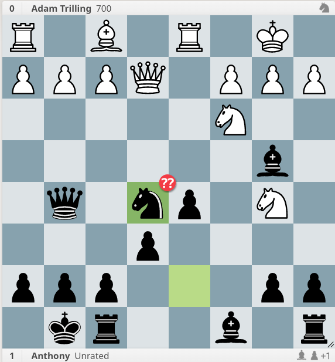

## Check for your opponent's attacks

White to play

Why is Nxe5 a blunder? If White responds f4 with a pawn fork, there's Qxf4 and we're safe. But the position is not quiet yet! Don't stop calculating unless the position is quiet. Look for your opponent's checks, captures, and attacks. 

1. ...Nxe5 2. f4 Qxf4 3. Rd4! (double attack on the Queen, and the Bishop.)
	3. ...Qe7 (to protect the Bishop on b4) 4. Qxe5
