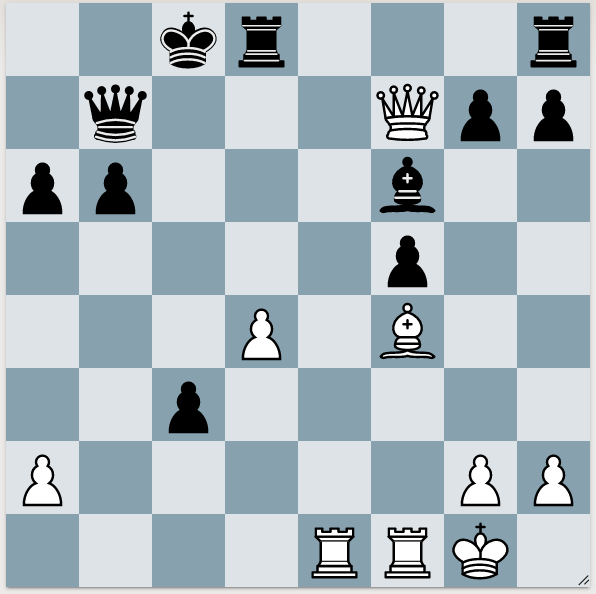
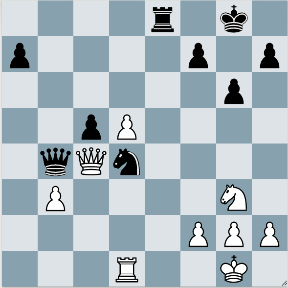

## Look for all your checks
This tactic shows why it's important to look for ALL checks.

White to move

Originally, all I saw was Qxb7+, Qc7+, Qd7+, and Qe6+. But the winning tactic is Qc4+! 

## Look for all your opponent's checks
This tactic shows why it's important to look for your opponent's checks.

White to move

1. Rxd4 Qxc4 2. Rxd4 wins. But...
1. Rxd4 Qe1+! (in-between move) 2. Nf1 cxd4 (Black wins the exchange)