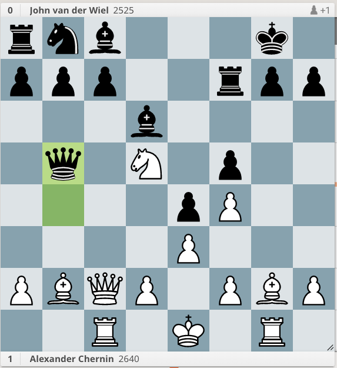

[[Understanding Chess Move by Move]]

1. Nf3 d6
2. g3 e5
	White is playing a modern opening. Instead of controlling the center with pawns, they're controlling it with their Knight. And soon, their LSB on g2.
3. Bg2 f5
	This chapter focuses on Black not developing their pieces. Black controls the center with their d, e, and f pawns. But they have not developers any pieces. White has developed this Bishop and Knight. They're prepared to castle.
	
4. c4 Nf6
	White sticks to a modern approach. Their c-pawn controls the d5 square. 
	5. Nc3 (develops a piece, and adds another attacker to the d5 square)

	It's good to see Black finally developing a piece.
	
5. b4 e4
	I'm surprised by b4. White is gaining more space on the Queenside. White has a lead in development and could push to keep the development lead. 
	
	Black starts to gain more space in the center. 6. Nh4 (and White's Bishop is staring at granite).
	White could try to undermine this pawn.
	
	6. Nh4 Be7 7. d3 e3 8. Bxe3
	    -> 7. ...exd3 8. Qxd3
		
6. Nd4 d5
	Why didn't I see Nd4. This is a better square than h4. The Knight is in a good outpost.
	6. ...c5 7. bxc5

	White's about to trade a wing pawn for a center pawn. 
	
7. cxd5 Nxd5
8. b5 Nf4
	I don't understand b5. (The pawn on b4 is en prise. It's attacked my Bishop and Knight. b5 gets the pawn safe. It also takes away Nc6)
	
	9. gxf4 Qxd4 (White's Kingside is blown up.)
	9. e3 Nxg2

9. gxf4 Qxd4
10. Nc3 Bc5
	White's defends their Rook by interposing. That's a danger of having not developing your pieces. Your rooks aren't connected and are vulnerable to tactics.
	
	Black threatens 11. ...Qxf2#. The developer their bishop with tempo. Maybe Black is starting to turn the game around. 
	
11. e3 Qc4
	A simple defense! (White defends with tempo). 
	
12. Bb2 O-O
13. Rg1 Re7
14. Rc1 Qb4
	Black sidesteps the Rook threatening it through x-ray. It's attacking White's DSB. 
	
15. Qc2 Bd6
16. Nd5 Qxb5
	This might be a poison pawn. White has some threats. Their Bishop and Rook are aiming at g7. The Knight might be threatening Nxc7 to attack the trapped Rook. 
	
17. Nf6+ Kh8
	17. ...gxf6 18. Bf1+ Kh8 19. Bxb5.

18. Bf1 Qxb2??
	What is the threat here?
	
19. Qxb2 Rxf6
20. Qxf6! gxf6
	Does this threaten 21. Bc4 and 22. Rg8#
	
21. Bc4 Be6
22. Bxe6 Na6
23. Ke2 Nc5
	White connects their rooks.

24. Bxf5 Rd8
25. Rg3 1-0
	26. Rcg1 27. Rh3 28. Rxh7#

# Tactics

rnb3k1/ppp2rpp/3b4/1q1N1p2/4pP2/4P3/PBQP1PBP/2R1K1R1 w - - 0 17
White to play.
1. Nf6+!
	1. ...gxf6 2. Bf1+ (discovered check, winning the Queen)
	1. ...Rxf6 2. Bxf6 gxf6 3. Bf1+