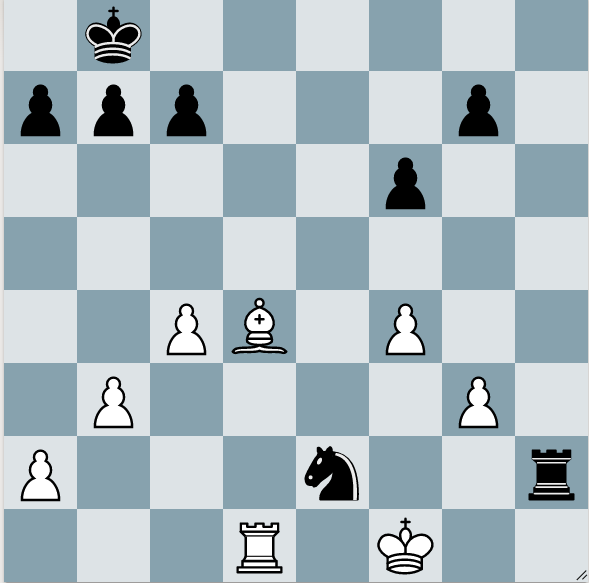

When you have a candidate move, you have to check if it's safe. How do you do that? Look at what checks, captures, and attacks your opponent has.

## Look for checks!

White to play

In this position, I played Bg1. I opened up a discovered attack with my Rook, threatening Rd8#. My bishop is also threatening to win the Rook. I saw my opponent could defend mate with Rh8; but Kxe2 wins the Knight.
But...I didn't check my opponent's checks, captures, and attacks. If I did, I would have seen (1. Bg1? Nxg3!! 2. Ke1 Re2#).

From "My Name is Tani" book. Tani's coach asks the students how they cross the street. Do they look both ways? Or do they just walk? What happens if you walk without looking? You're going to get hit by a car. This is the same with chess. You need to look both ways and check if your moves are safe. Otherwise, you're going to get hit by a proverbial car.