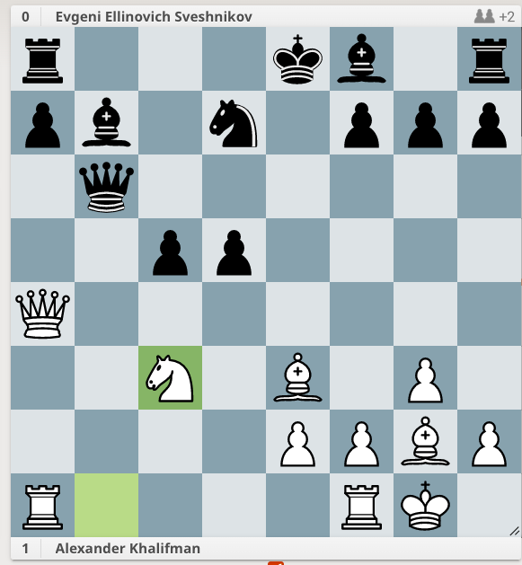

1. d4 d5
2. c4 e6
	Black supports their d5 pawn.

	2. ...dxc4 3. Qa4+ (Black cannot hold onto the pawn)
3. Nf3 c6
	Black adds another defender to the d5 pawn. This might be too many pawn moves.

4. g3 Nf6
	White prepares to fianchetto their LSB.

5. Bg2 dxc4
	Black plays another pawn move.

6. O-O b5
	Black plays another pawn move, trying to hold onto their c pawn.
	White is ahead in development. They have made 3 development moves (Nf3, Bg2, O-O). Black has made one development move (Nf6).

7. a4 Bb7
	White undermines the b5 pawn.
	7. ...bxa5 8. Qxa4

8. Ne5 Qb6
	White adds a second attacker to the c6 pawn. Black adds a third defender to it.

9. b3 cxb3
	Interesting. It's another undermining move.

10. Qxb3 Nbd7
	Black's starting to develop more. They should get their King to safety, but castling Queenside might be tricky.

11. Be3 c5

12. Nxd7 Nxd7

13. d5 bxa4

14. Qxa4 exb5

15. Nc3 d4
	White's puts themself into a pawn fork.

16. Nd5 Bxd5
	White gets out of the pawn fork.

17. Bxd5 Rd8
	17. ...dxe3 (wouldn't this win a minor piece?) 18. Bxf7+ Kxf7 19. Qxd7+

18. Bf4 Qf6

19. Qb5 Bd6

20. Ra6 Rb8
	White pins the DSB.

21. Bb7 Bxf4

22. Rxf6 gxf6

23. gxf4 f5

24. Qc6 Kd8
	White steps out of the pin.

25. Qd5 Kc7

26. Bc6 1-0

r3kb1r/pb1n1ppp/1q6/2pp4/Q7/2N1B1P1/4PPBP/R4RK1 b kq - 1 15

White walks into a pawn fork, after 1. ...d4. But keep calculating until the position is quiet.
After 1. ...d4 2. Nd5 (attacking Black's Queen) Bxd5 3. Bxd5 (attacking Black's Rook) Rd8 4. Bf4