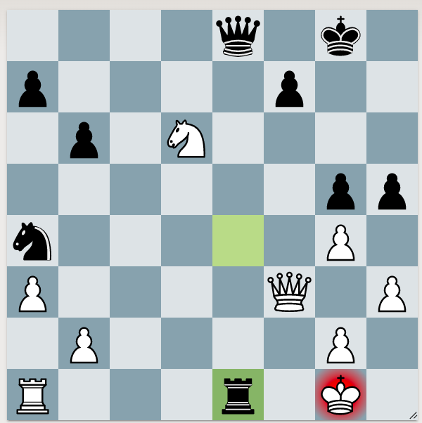

Loose pieces are pieces en prise, or are under-defended, or can be underdefended.

For example, if piece is attacked once, and only defended once. This piece is a target. Look to see if you can bring another attacker.

## King as an attacker

Chess Step 2, thinking ahead. Page 6, problem 7.
White is under check. But don't get flustered. Go through the normal checklist. The Black Rook on e1 should be viewed as a target. It's attacked once, and defended once. Can we bring another attacker?
	Yes! Kf2. Don't forget that the King can also be an attacker. It doesn't always have to hide at the first sign of danger.