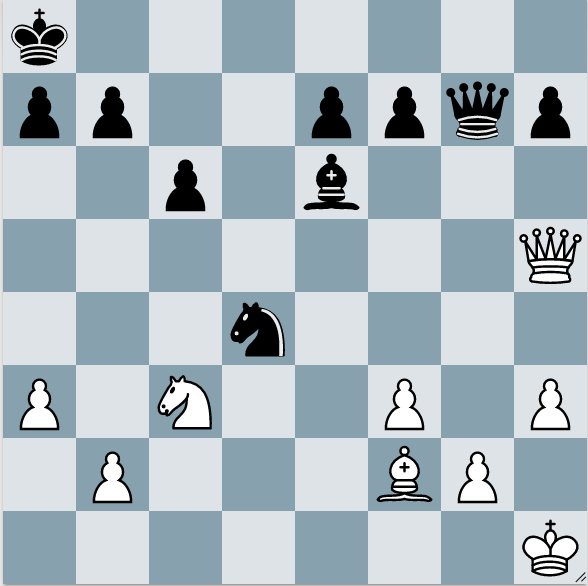
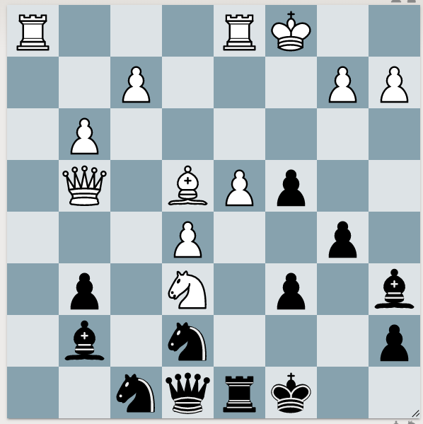
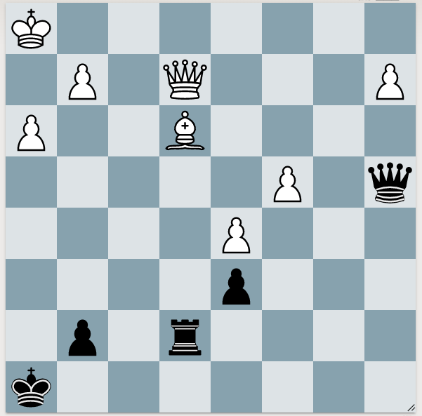

# Pins
Bishops, Rooks, and Queens can make pins. Look at their lines of influence. Their lines of influence goes "through" friendly and enemy pieces.

## Pin through enemy piece

White has a bishop on f2. It looks through the Kight on d4 and attacks a7. White plays Qc5, and the Knight is pinned. If the Knight moves, then Qxa7#. If b6, then 1. Qxd4 Qxd4 2. Bxd4 wins the Knight.

## Pinning an already attacked piece

Black to play

This was a hard pin for me to see. Notice that White's knight on e6 is defends by the Queen. But there's another problem. When something is defending, it also means that it's on the same diagonal or file. Look for pin opportunities then.

## Escaping a pin (checks)

Black to play

Black's rook pins White's Bishop to their Queen. We should add pressure to the pinned piece. But we have to be careful. If we allow the back piece to escape with tempo, then the front piece can get away safely. 
So 1. ... Qa3 adds a second attacker to the Bishop. But White has a defense. This is why we look for checks, captures, and attacks for the opponent. 2. Qh5+ Kg8 3. Bf1 (the Bishop escapes to safety)

The correct move is 1. ...Qe8. Now 2. Qh5+ Qxh5. [[Look for opponent's moves]]