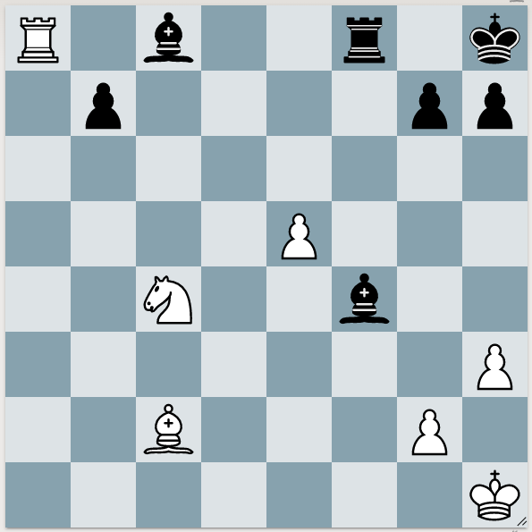

It's easy to stop calculations short. When you see that you lose a piece, players stop calculation. But then they might miss the follow-up checkmate!

## Worried about checkmate, but you have checkmate yourself!

R1b2r1k/1p4pp/8/4P3/2N2b2/7P/2B3P1/7K w q - 0 1

1. Nd6 Bxe5 (White to play)
Step 2, Thinking Ahead. Page 5, problem 9.

The answer is, 2. Nf7+
Originally, I stopped calculation of this move. After 2. ...Rxf7, Black is threatening Rf1#. So why continue with this variation? But the position is not quiet yet! What forcing moves does White have? 3. Rxc8+, and then we notice Black's backrank weakness. 
	2. ...Rxf7 3. Rxc8+ Rf8 4. Rxf8#
We also notice that Black's Rook is pinned.