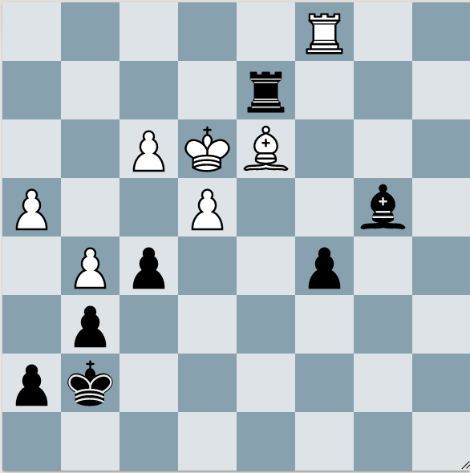

Black to play

Sometimes, removal of the guard involves a check. When you give a check, this doesn't mean you have to follow up with looking for subsequent checks. Remember, checks, captures, attacks.